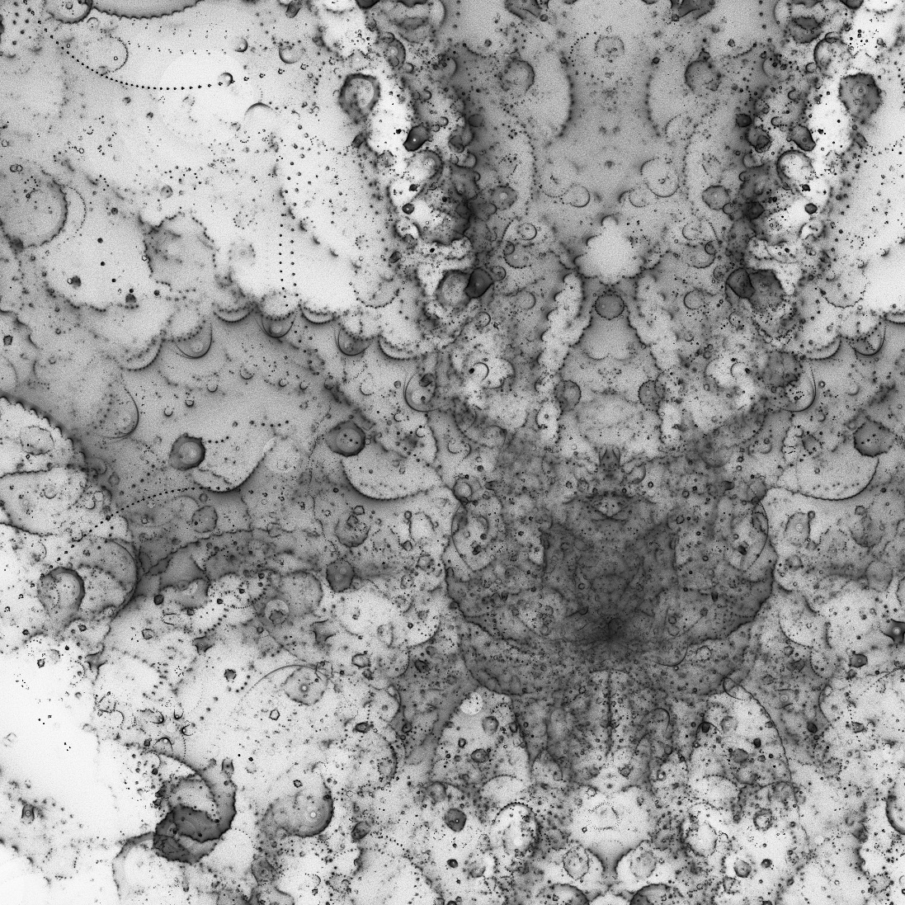
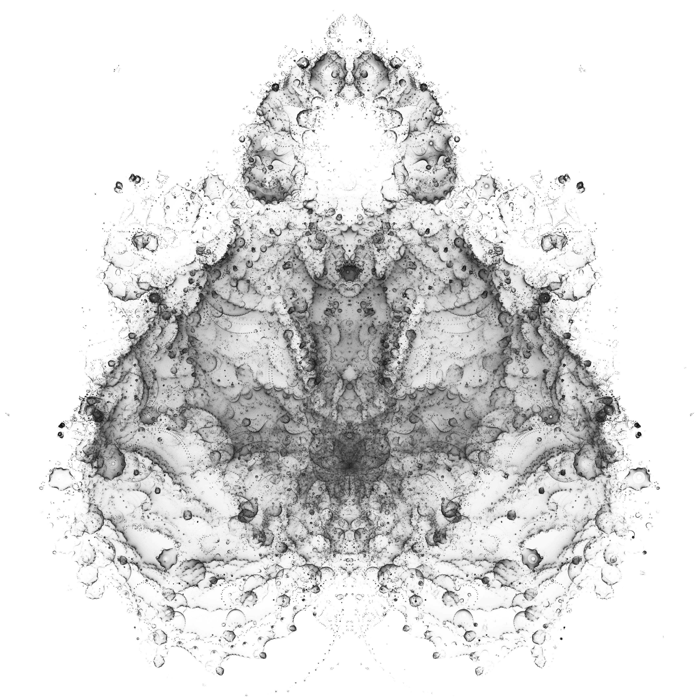
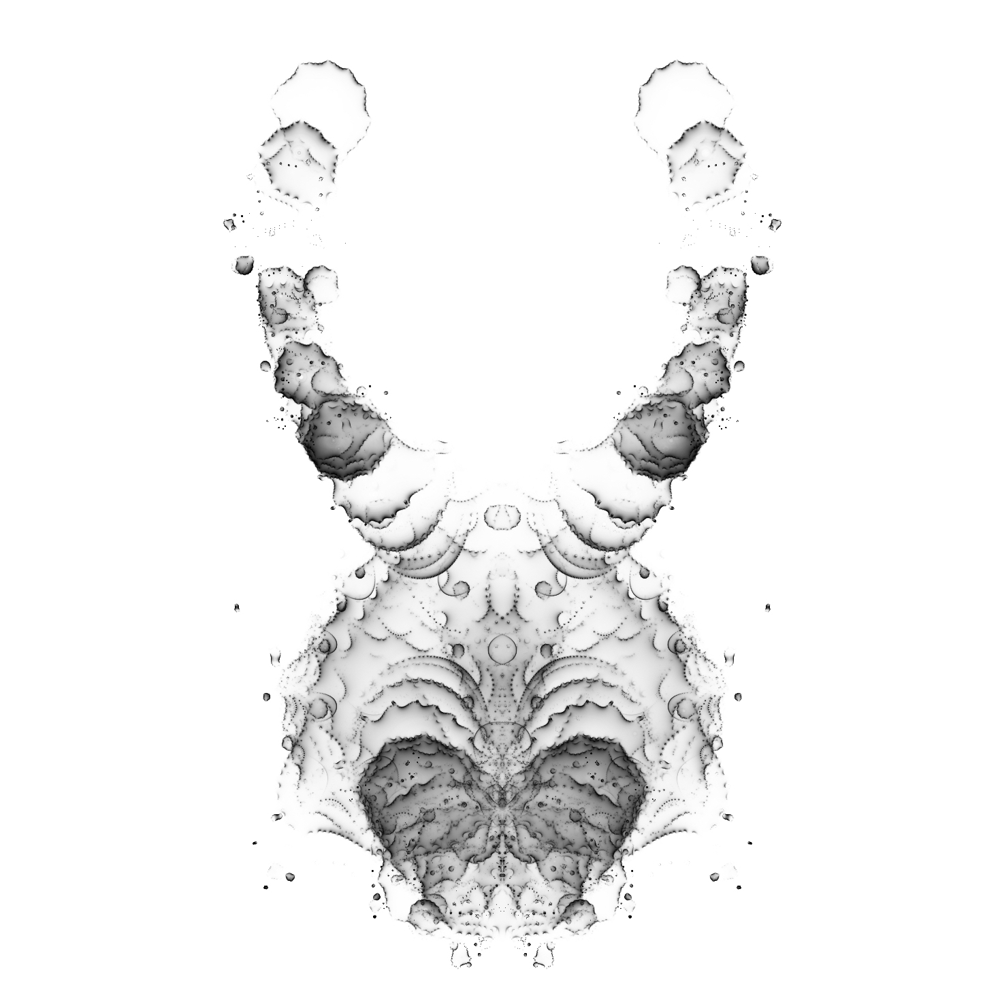
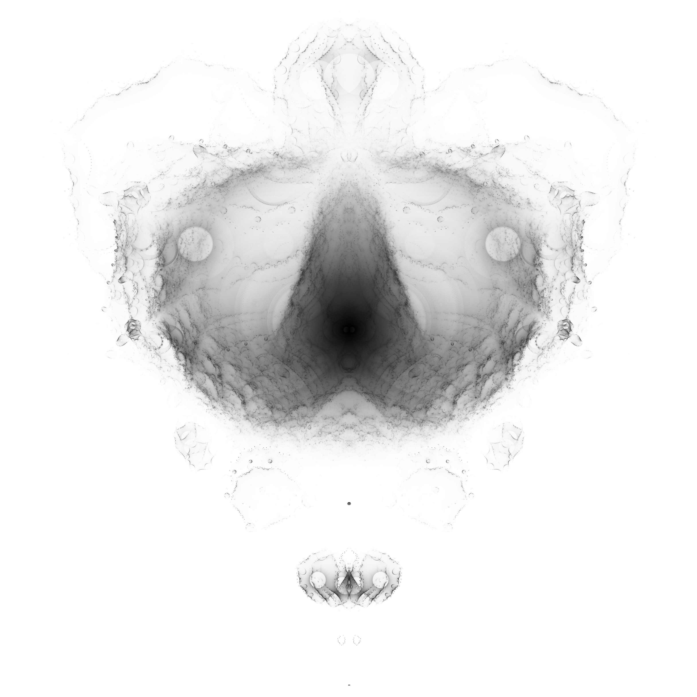

# Multithreaded Buddhabrot Computation

Rendering fractals with the [Buddhabrot technique](https://en.wikipedia.org/wiki/Buddhabrot) discovered by [Melissa Green](http://superliminal.com/fractals/).

An optimization is implemented to compute "hint" points, i. e. points that are likely to produce viable samples. The hint pass recurses every pixel until it escapes or reaches the maximum recursion depth. Only points that escape between the minimum and maximum recursion depth are relevant in later stages. Thus these points are saved as "hints" and are used for later computation of the actual fractal image. In this process, a random hint is selected, moved a "fuzz" amount in the real and complex plane, and then computed as a possible usable point.

One hint file may be computed for multiple iterations of the image computation. It can be read from a file or computed when needed. The hint does not have to have the same exact parameters of the image, especially resolution. It just needs to provide quality candidate points for the threads to use in the recursion.

Additionally, a histogram method is used to compute the final brightness of each pixel in the exported image. The darkest 1/256th of the pixels are assigned color (0,0,0), the next 1/256th get color (1,1,1), and so on until the brightest color, (255, 255, 255), is reached.

Tested with clang++ on OSX 10.11.6.

### Sample output:

